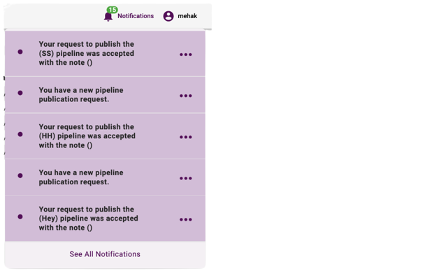

.. _notifications:

Notifications
**************

Overview
================

The notifications view within LigaData Flare displays the status of all your requests for publishing a pipeline upon approval and the pipeline publication requests that require your attention.

To access this section, click on the **Notifications** icon located at the top right corner of the screen. A dropdown will appear with the list of pipeline specific updates as shown in the image below.

To view all the notifications in a new page, click on **See All Notifications**.

Similarly, to view which section in which the update was made, click on that notification. It will take you to the page from which the request originated. 