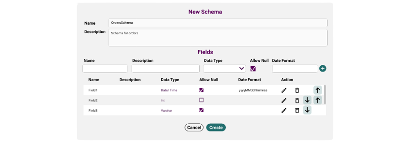

.. _schemas:

Schemas in Flare
*******************

Overview
===================

The Schema section within LigaData Flare provides you with the ability to define source data structure and the schema to be included in the pipelines.

To access the schemas section, select Schemas from the main menu. The following page will appear on the screen.

.. figure::  schemas.png
    :align:   center 

.. _addnewschema:

Add New Schema
====================

To add a new schema, follow the steps below:

1. Click on the **+ Create New Schema** button located at the top right corner of the UI. A dialog box will appear on the screen. 

2. Specify the following information:

+---------------+------------------------------------------------------------------------+
| Field         | Description                                                            | 
+===============+========================================================================+
| Name          | Specify the name of the schema                                         |
+---------------+------------------------------------------------------------------------+
| Description   | Specify the description for the schema                                 |
+---------------+------------------------------------------------------------------------+
| Attributes    | To add an attribute, provide the following information:                |
|               |   * Name: Specify the name of the attribute                            |
|               |   * Description: Specify the description of the attribute              | 
|               |   * Data Type: Select the data type of the attribute from the dropdown |
|               |   * Allow Null:                                                        |
|               |   * Data Format:                                                       |
|               |       Once done, click on the plus icon.                               |
+---------------+------------------------------------------------------------------------+

.. Note::
    * To edit an attribute, click on the edit icon corresponding to that attribute and make the required edits.
    * To delete an attribute, click on the delete icon corresponding to that attribute.
    * To move the attribute up or down, click on the relevant arrow.

3. Click on the Create button to proceed.
     The schema will be created successfully.

Copy Schema
=================

To create a duplicate of a schema, follow the steps below:

1. Click on the Copy icon under the Actions column, corresponding to the schema to be copied. A dialog box will appear on the screen.

2. Click on the Confirm button to proceed.
A copy of the schema will be created successfully.

.. admonition:: Info

    The naming convention of the duplicate schema consists of the original name followed by **_copy** as a suffix.

Edit Schema
================

To edit a schema, follow the steps below:

1. Click on the **Edit** icon under the **Actions** column, corresponding to the schema to be edited. A dialog box will appear on the screen.

2. Make the required changes. 

3. Click on the **Save** button to proceed.
The schema will be edited successfully. 

.. Note::
    To learn about the fields in the edit schemas section, refer to the Add New Schema :ref:`Add New Schema <addnewschema>` section.

Delete Schema
===================

To delete a schema, follow the steps below:

1. Click on the **Delete** icon under the **Actions** column, corresponding to the schema to be deleted. A dialog box will appear on the screen.

2. Select **Confirm** to proceed.

The schema will be deleted successfully.

Import Schema
================

To import a schema, follow the steps below:

1. Click on the **+ Import Schema** button located at the top right corner of the UI. The file explorer modal will appear on the screen

2. Browse and select the schema file to be imported.

3. Click on the **Open** button to proceed.
The schema will be imported successfully.

Troubleshooting
==================